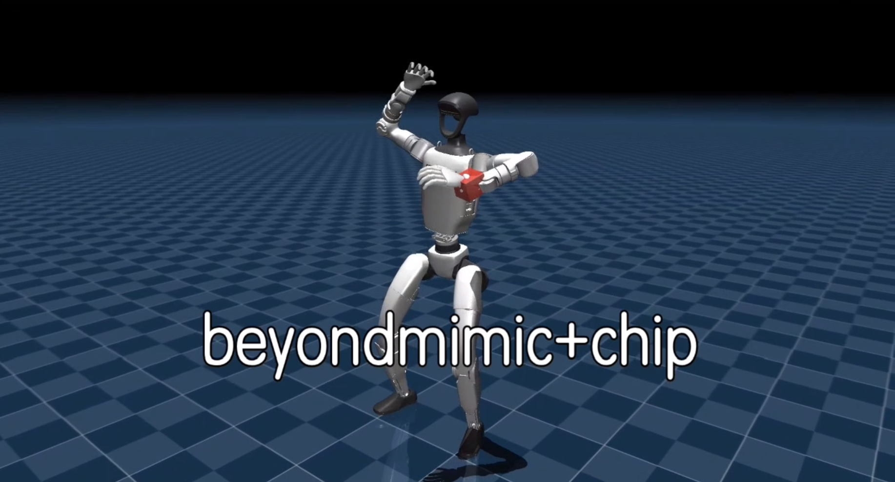

# CHIP Minimal Upload

This directory is a clean GitHub upload candidate that only keeps the code
needed to train and deploy the CHIP policy.

## Demo

[Click Picture to play video]

[](https://blackotters.github.io/chip/demo/)

## Upstream bases

- mjlab: https://github.com/mujocolab/mjlab at commit `a0ba058`
- RoboJuDo: https://github.com/HansZ8/RoboJuDo at commit `ed7601f`

## Layout

- `train/mjlab_overlay/`: CHIP training code overlay for mjlab
- `deploy/robojudo_overlay/`: CHIP deployment code overlay for RoboJuDo
- `scripts/apply_overlay.sh`: copy overlays into fresh upstream checkouts
- `metadata/upstreams.txt`: exact upstream references used to build this export
- `runtime_assets/`: optional runtime assets copied only with `--include-runtime-assets`

## Excluded on purpose

- Nested `.git/` directories
- Virtual environments such as `.venv/`
- Logs and experiment outputs: `logs/`, `wandb/`, `train_logs/`
- Generated data: `generated_motions/`, `*.npz`
- Model checkpoints: `model_*.pt`
- Third-party SDK source trees such as `third_party/unitree_sdk2/`

## Recommended GitHub strategy

Push this directory as a new repo. Keep only code in Git. Put large checkpoints,
motion files, and local SDK trees in GitHub Releases, cloud storage, or Git LFS
only if you truly need versioning for them.

## Apply the overlays

```bash
git clone https://github.com/mujocolab/mjlab.git
git clone https://github.com/HansZ8/RoboJuDo.git

cd "chip_github_repo"
./scripts/apply_overlay.sh /path/to/mjlab /path/to/RoboJuDo
```
